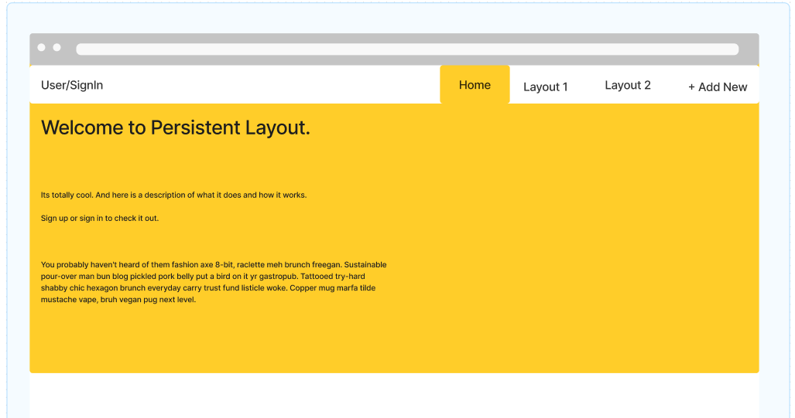
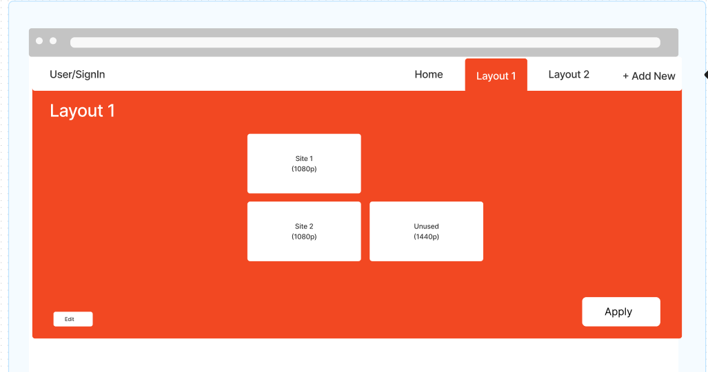

# Design notes

Design notes for frontend layout and functionality.

## Page Layout/Menu

### Tabs Goal
Tabs should have an interesting style, perhaps something more retro and simple such as :

### Home Page
Home page should load all available layouts in the menu, show the active one/current page, and have an ``+Add New`` button at the end to add new.

### Layout Page
Layout shows the layout itself and allows editing.

### Palette Options

### Window methods

#### Movement
https://developer.mozilla.org/en-US/docs/Web/API/Window/moveBy
https://developer.mozilla.org/en-US/docs/Web/API/Window/moveTo

#### Opening new
https://www.educative.io/answers/how-to-open-a-link-in-a-new-tab-with-html-and-javascript